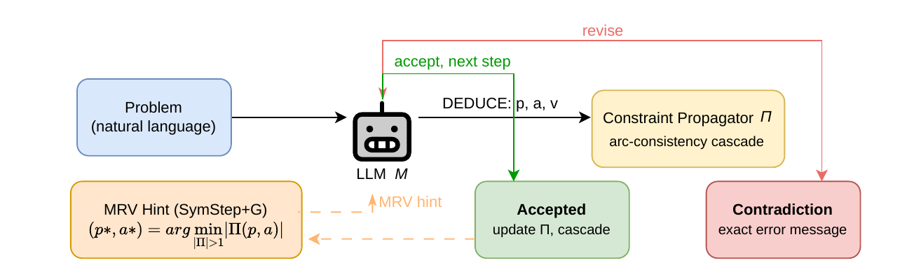

# SymStep: Per-Step Symbolic Verification Reaches 97% on Published Benchmarks Where Chain-of-Thought Scores 0%

> **Chain-of-thought: 0%. Logic-LM: 0%. SymStep+G: 97–100%.**  
> *One idea. One propagator. Six benchmarks.*

[](https://github.com/Zangir/SymStep/stargazers)
[](https://github.com/Zangir/SymStep)
[](https://python.org)
[](LICENSE)
[](https://anthropic.com)

<p align="center">
  
</p>

<p align="center"><em>One claim at a time. The propagator verifies every step — no inconsistent fact is ever accepted.</em></p>

<p align="center"><b>⭐ If this is useful, star the repo — it helps others find it.</b></p>

---

## The Problem: Every Unverified Step Is a Ticking Time Bomb

LLMs reason in free-form text. Each step can silently introduce an error. By step 7, the model deduces Alice owns the dog — without noticing it proved Alice owns a cat in step 3. Chain-of-thought makes this **worse**: it generates *more* steps, each a fresh opportunity for contradiction.

This is not a model capability problem. It is an **architecture problem** — there is no mechanism to catch errors as they happen. The longer the reasoning chain, the deeper the inconsistencies are buried by the time the final answer is written.

---

## The Fix: One Claim. One Check. Every Time.

SymStep couples an LLM with a lightweight symbolic **constraint propagator** operating at the granularity of individual deduction steps:

```
LLM:        DEDUCE: Alice, pet, Cat
Propagator: ✓ Accepted. Alice.pet = Cat → removes Cat from Bob, Carol.
            [Hint] Bob's color must be one of: {Red, Green}

LLM:        DEDUCE: Alice, pet, Dog
Propagator: ✗ CONTRADICTION: Alice.pet is already Cat. Please revise.
```

Every claim is verified before it enters the LLM's context. No inconsistent fact is ever accepted.  
The propagator also **cascades arc-consistency** — automatically deriving new eliminations the LLM would miss.

**SymStep+G** adds one more idea: an MRV (Minimum Remaining Values) hint after each accepted step, pointing the LLM toward the most constrained unsolved variable and breaking deductive deadlocks before they arise.

---

## Results That Speak for Themselves

### Published External Benchmarks

| Method | ZebraLogicBench (35) | AR-LSAT (15) | AQUA-RAT (35) |
|--------|---------------------|--------------|---------------|
| Direct | 0% | 100% | 86% |
| CoT | **0%** | 87% | 89% |
| Logic-LM | — | — | — |
| SymStep | 80% | **100%** | 66% |
| **SymStep+G** | **97%** | **100%** | **89%** |

> ZebraLogicBench is a published 1,000-puzzle ICML 2025 benchmark of Einstein-style logic puzzles.  
> SymStep was **never shown these puzzles during design**. Direct and CoT score 0% on all 35 evaluated sizes.

### LGP-14 — Our Benchmark (14 puzzles, 3 difficulty levels)

| Method | Easy (4) | Medium (5) | Hard (5) | **Total** | 95% CI |
|--------|----------|-----------|----------|-----------|--------|
| Direct | 2/4 | 0/5 | 0/5 | 14% | [4, 40]% |
| CoT | 0/4 | 0/5 | 0/5 | **0%** | [0, 22]% |
| Self-Refine | 0/4 | 1/5 | 4/5 | 36% | [16, 61]% |
| Logic-LM | 0/4 | 0/5 | 0/5 | **0%** | [0, 22]% |
| SymStep | 4/4 | 4/5 | 4/5 | 86% | [60, 96]% |
| **SymStep+G** | **4/4** | **5/5** | **5/5** | **100%** | **[79, 100]%** |

> SymStep+G's 95% CI lower bound (79%) strictly exceeds every baseline's upper bound (22%).  
> Statistical significance confirmed at n=14 without needing a large dataset.

### Six-Domain Sweep

| Method | LGP-14 | ZLB | SP-6 | LSAT | MWP-8 | FIN-6 |
|--------|--------|-----|------|------|-------|-------|
| Direct | 14% | 0% | 0% | 100% | 88% | 67% |
| CoT | 0% | 0% | 0% | 87% | 100% | 83% |
| SymStep | 86% | 80% | **83%** | **100%** | **100%** | **100%** |
| **SymStep+G** | **100%** | **97%** | 67% | **100%** | **100%** | **100%** |

---

## The Ablation That Changes the Story

> *If you only read one table, read this one.*

| Config | Acc | Std | Contradictions |
|--------|-----|-----|----------------|
| CoT (no augmentation) | 0% | 0.0 | — |
| Verification only | 72% | 9.6 | 0 |
| **Guidance only** | **100%** | **0.0** | **0** |
| SymStep+G (both) | **100%** | **0.0** | **0** |

The primary bottleneck is not *incorrect* deductions — it is *directionless* ones. Once the LLM is told which variable to try next (MRV hint), it makes only correct deductions. Zero contradictions across all guided runs. **18/18 puzzles solved across 3 independent runs.**

---

## How It Works

```
┌──────────────────┐   DEDUCE: p, attr, val    ┌─────────────────────────────┐
│  Problem         │ ─────────────────────────→ │  Constraint Propagator Π    │
│  (natural lang.) │                            │  arc-consistency cascade    │
└──────────────────┘                            └─────────────────────────────┘
        ↑                                                     │
        │                                        ┌────────────┴──────────────┐
        │  ✓ accepted + MRV hint (SymStep+G)     │                           │
        └────────────────────────────────        ↓ ✓ OK                      ↓ ✗ Contradiction
                                             update Π, cascade           exact error message
                                             MRV hint: "X's attr              │
                                             must be one of: {…}"             │
                                                     └─────────────────────────┘
                                                              │
                                                       back to LLM
```

**Arc-consistency cascade**: after each accepted deduction, the propagator eliminates the value from all other entities and checks for singletons. Any forced assignment is made automatically — triggering a chain of further deductions, no LLM call needed. On a 4×3 puzzle, ~60% of assignments are derived this way.

**MRV guidance**: `(p*, a*) = argmin |Π(p, a)|` — pick the most constrained unsolved variable. Natural-language hint. Breaks deadlocks deterministically.

---

## Why Not Just Use Logic-LM?

Logic-LM asks the LLM to write complete Z3 Python code for the entire puzzle in one shot — then hands it to a solver. It achieves **0%** on LGP-14 and SP-6. Any error in any clue's encoding breaks the entire program.

SymStep never asks for a complete encoding. It asks for **one checkable fact at a time**. The LLM only needs to express a single atomic claim in a regex-parseable format. This is orders of magnitude less error-prone than full program synthesis.

---

## Repository Structure

```
SymStep/
├── README.md
├── experiments/
│   ├── symstep.py              # Core engine: LGP-14, SP-6, Logic-LM baseline
│   ├── extended.py             # LGP-14 puzzle set (E3–H5) used by the runners
│   ├── math_reasoning.py       # MWP-8: arithmetic word problems
│   ├── fin_reasoning.py        # FIN-6: financial reasoning
│   ├── ablation.py             # Component ablation: verification vs. guidance
│   ├── run_full.py             # Full multi-domain experiment runner
│   ├── run_new_benchmarks.py   # SP-6 + extended domain runner
│   ├── math_bench.py           # MWP-8 benchmark definitions
│   ├── lsat_bench.py           # AR-LSAT benchmark (analytical reasoning)
│   ├── zebralogic_bench.py     # ZebraLogicBench integration + CSP solver
│   ├── ci_utils.py             # Wilson 95% confidence interval utilities
│   ├── compile_results.py      # Aggregate results across runs
│   └── verify_puzzles.py       # Propagator-based uniqueness verification
└── results/
    ├── lgp14_combined.json          # LGP-14 main results (Haiku)
    ├── sonnet_results.json          # LGP-10 cross-model results (Sonnet)
    ├── scheduling_results.json      # SP-6 scheduling benchmark
    ├── math_results.json            # MWP-8 arithmetic results
    ├── fin_results.json             # FIN-6 financial reasoning
    ├── zebralogic_results.json      # ZebraLogicBench (35 puzzles)
    ├── lsat_results.json            # AR-LSAT (15 problems)
    ├── aquarat_results.json         # AQUA-RAT (35 problems)
    └── ablation_multirun.json       # N=3 multi-run ablation on LGP-6
```

---

## Quickstart

**Requirements:** Python 3.9+, and the [Claude Code CLI](https://claude.ai/code) installed and authenticated (SymStep calls the model through the `claude` CLI, so no API key or client library is needed).

```bash
git clone https://github.com/Zangir/SymStep.git
cd SymStep

# Optional: only needed for the external Hugging Face benchmarks
# (ZebraLogicBench, AR-LSAT, AQUA-RAT, GSM8K)
pip install -r requirements.txt

# Run all methods on LGP-14 (logical grid puzzles) — no extra deps
python3 experiments/symstep.py

# Run ZebraLogicBench (external published benchmark)
python3 experiments/zebralogic_bench.py

# Run AR-LSAT analytical reasoning
python3 experiments/lsat_bench.py

# Run math word problems (MWP-8)
python3 experiments/math_reasoning.py

# Run financial reasoning (FIN-6)
python3 experiments/fin_reasoning.py

# Run full multi-run ablation
python3 experiments/run_full.py
```

**Use a different model:**
```bash
SYMSTEP_MODEL=sonnet python3 experiments/symstep.py
```

**Override Claude binary location:**
```bash
CLAUDE_BIN=/path/to/claude python3 experiments/symstep.py
```

---

## The DEDUCE Protocol

SymStep uses a minimal structured output format that requires no formal logic training:

```
DEDUCE: <Entity>, <attribute>, <Value>        # positive deduction
DEDUCE: <Entity>, <attribute>, NOT <Value>    # elimination
CONCLUDE: done                                # task complete
```

For arithmetic/financial/scheduling domains:
```
DEDUCE: balance_year1 = 5500          # numeric assignment
DEDUCE: break_even_units = 1000       # derived quantity
```

Regex-parseable. No Prolog. No Z3. No formal logic training required.

---

## Key Findings

1. **CoT actively hurts on constraint-dense tasks.** 0% on LGP-14 and ZebraLogicBench across Haiku and Sonnet. More steps = more unverified errors. CoT is fine on arithmetic (100% on MWP-8) — the failure is constraint-density-specific.

2. **Logic-LM, the SOTA symbolic+LLM baseline, achieves 0%.** One-shot Z3 program synthesis is too brittle. Any misencoded clue breaks everything.

3. **The key bottleneck is direction, not correctness.** Guidance alone achieves 100% with zero contradictions. Once pointed to the most constrained variable, the LLM makes only correct deductions. The verifier is a safety net — the hint is the engine.

4. **97% on an independent 1,000-puzzle benchmark never seen during design.** ZebraLogicBench has different vocabulary, attribute types, and clue conventions. SymStep's symbolic propagator operates on assignment structure, not surface form.

5. **Domain-agnostic at near-zero engineering cost.** Six domains, one outer loop, one `DEDUCE` format. Only the symbolic verifier adapts per domain.

6. **Cost: $0.0013 per puzzle with Claude Haiku.** Full LGP-14 benchmark under $0.02. Logic-LM's effective cost per *correct* answer is infinite (0% accuracy).

---

## Reproducibility

All results are single-run on Claude Haiku (`claude-haiku-4-5`) unless noted. Multi-run ablation on LGP-6 (N=3 independent runs):

| Config | Mean Acc | Std | Evaluations |
|--------|----------|-----|-------------|
| CoT | 0.0% | 0.0 | 18/18 fail |
| Verification only | 72.2% | 9.6 | — |
| Guidance only | 100.0% | 0.0 | 18/18 pass |
| **SymStep+G** | **100.0%** | **0.0** | **18/18 pass** |

Zero-variance reproducibility confirmed across all guided configurations.

---

## Contributing

SymStep is deliberately small — one outer loop, one `DEDUCE` format, one symbolic
verifier per domain. That makes it easy to extend, and contributions are very welcome:

- **New domains.** Add a verifier (a propagator or tracker) for a new problem type — temporal ordering, graph coloring, routing, or your own. The LLM loop stays unchanged.
- **New backends.** Swap the Claude CLI call in `symstep.py:call_llm` for another model (OpenAI, local models, an API-key client).
- **New benchmarks.** Wire up another logic/reasoning dataset and share the numbers.
- **Better guidance.** Try alternatives to MRV (degree heuristics, learned guidance) and report what moves the needle.

Open an issue to discuss an idea, or send a PR. If you build on SymStep, we'd love to hear about it.

If the project is useful to you, please **⭐ star it** — it genuinely helps others discover the work.

---

## Citation

```bibtex
@inproceedings{symstep2026,
  title     = {SymStep: Symbolic Step Verification for Logical Reasoning},
  author    = {Usmanova, Aida and Gao, Rui and Azizov, Dilshod and Usbeck, Ricardo and Iklassov, Zangir},
  booktitle = {NILA Workshop @ IJCAI-ECAI 2026},
  year      = {2026}
}
```

---

By Aida Usmanova, Rui Gao, Dilshod Azizov, Ricardo Usbeck, and Zangir Iklassov
(Leuphana University of Lüneburg · MBZUAI). Maintained by
[Zangir Iklassov](https://github.com/Zangir). If SymStep is useful to you,
please ⭐ the repo — issues and pull requests are welcome.
